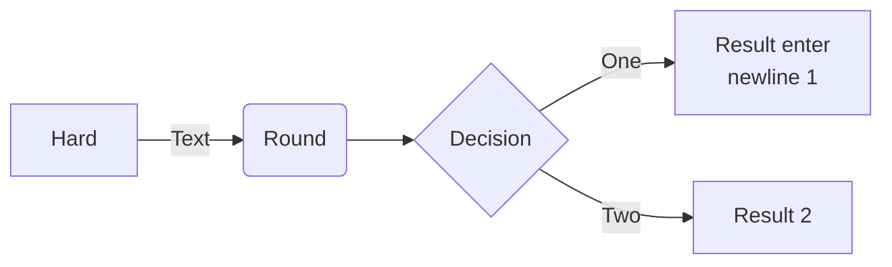
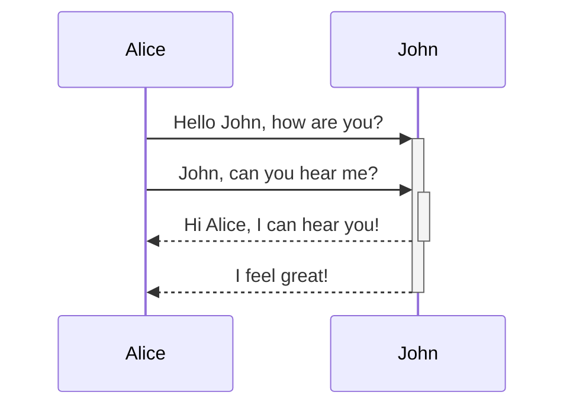

tag:  #N/S/Stub #N/T/Definition  #T/T/To/Brain #N/T/Public 
2021-11-30 16:53, [Source](),  
Related:  [[markdown-sample]]

Markdown (произносится маркда́ун) — облегчённый язык разметки, созданный с целью написания наиболее читаемого и удобного для правки текста, но пригодного для преобразования в языки для продвинутых публикаций.


#####  Шпаргалка по маркдауну гитлаб:
https://docs.gitlab.com/ee/user/markdown.html
https://about.gitlab.com/handbook/markdown-guide/


##### как изменять размер картинок в обсидиане!

Взять ссылку, добавить "|" подпишите в конце и напишите число.  
Например. :
For markdown images, use ``

For embeds, use `![[image.png|100x100]]`

To have the image scale according to its aspect ratio, omit the height `![[image.png|100]]`


Obsidian is a Markdown-based note-taking and knowledge base app. 

We currently support the formats below:

---

### Internal linking
```md
Link to a page: [[Internal link]].
```
Link to a page: [[% Obsidian]].

---
### Embeds
Embed another file. Here's an embedded section:
```md
![[Obsidian#What is Obsidian]]
```
![[% Obsidian#С чего начать знакомство с обссидиан]]

---
### Ссылка на файл по абсолютному пути 

`[filename](file:///<absolute-path>)`
```
[link](file:///d:/absolute.md)    # absolute filesystem path
[Link to file in another dir on same drive](/another/dir/filename.md)
[Link to file in another dir on a different drive](/D:/dir/filename.md)


[link](./relative1.md)            # relative to opened file
[a relative link](../../some/dir/filename.md) 

[link](/relativeToProject.md)     # relative to opened project

[filename](file:///C:\Users\vladlen\Downloads\file.jph)
[a relative link](../../SSL) 

[YourDocument](<../../../README.md>)
[YourDocument](<../../../tesst.txt>)
```

Если в имени файла есть пробелы, попробуйте следующее:
любое `whitespace`в пути следует заменить на`%20`

```
[file](./file%20with%20spaces.md)
[file](<./file with spaces.md>)
```
--- 

### Headers

```md
# This is a heading 1
## This is a heading 2
### This is a heading 3 
#### This is a heading 4
##### This is a heading 5
###### This is a heading 6
```

# This is a heading 1
## This is a heading 2
### This is a heading 3 
#### This is a heading 4
##### This is a heading 5
###### This is a heading 6

---

### Emphasis

```md
*This text will be italic*
_This will also be italic_
```

*This text will be italic*
_This will also be italic_

```md
**This text will be bold**
__This will also be bold__
```

**This text will be bold**
__This will also be bold__

```md
_You **can** combine them_
```

_You **can** combine them_

---

### Lists

```md
- Item 1
- Item 2
  - Item 2a
  - Item 2b

1. Item 1
1. Item 2
1. Item 3
   1. Item 3a
   1. Item 3b
```

- Item 1
- Item 2
  - Item 2a
  - Item 2b

1. Item 1
1. Item 2
1. Item 3
   1. Item 3a
   1. Item 3b

--- 

### Images

```md

```


#### Resizing images

Example of this above image resized to 100 pixels wide:

```md

```


---

### Links

```md
http://obsidian.md - automatic!
[Obsidian](http://obsidian.md)
```

http://obsidian.md - automatic!
[Obsidian](http://obsidian.md)

Markdown style links can be used to refer to either external objects, such as web pages, or an internal page or image. If there are spaces in the url, they can be escaped by either using `%20` as a space, such as [Export options](Pasted%20image), or by enclosing the target in `<>`, such as [Slides Demo](<Slides Demo>).

---

### Blockquotes

```md
> Human beings face ever more complex and urgent problems, and their effectiveness in dealing with these problems is a matter that is critical to the stability and continued progress of society.

\- Doug Engelbart, 1961
```

> Human beings face ever more complex and urgent problems, and their effectiveness in dealing with these problems is a matter that is critical to the stability and continued progress of society.

\- Doug Engelbart, 1961

---

### Inline code

```md
Text inside `backticks` on a line will be formatted like code.
```

Text inside `backticks` on a line will be formatted like code. 


---

### Code blocks

Syntax highlight is supported with the language specified after the first set of backticks. We use prismjs for syntax highlighting, a list of supported languages can be found [at their site](https://prismjs.com/#supported-languages)

<pre><code>```bash
#!/bin/bash
logged_on=$(who | grep -i -m 1 $1 | awk '{print $1}')
if [ -z $logged_on ]
then
echo "$1 is not logged on."
echo "Exit"
exit
fi
allowed=$(who -T | grep -i -m 1 $1 | awk '{print $2}')

```</code></pre>

```bash
#!/bin/bash
logged_on=$(who | grep -i -m 1 $1 | awk '{print $1}')
if [ -z $logged_on ]
then
echo "$1 is not logged on."
echo "Exit"
exit
fi
allowed=$(who -T | grep -i -m 1 $1 | awk '{print $2}')

```
    
	
```md
    Text indented with a tab is formatted like this, and will also look like a code block in preview. 
```

    Text indented with a tab is formatted like this, and will also look like a code block in preview. 
    
---

### Task list

```md
- [x] #tags, [links](), **formatting** supported
- [x] list syntax required (any unordered or ordered list supported)
- [x] this is a complete item
- [ ] this is an incomplete item
- [ ] tasks can be clicked in Preview to be checked off
```

- [x] `#`tags, [links](), **formatting** supported
- [x] list syntax required (any unordered or ordered list supported)
- [x] this is a complete item
- [ ] this is an incomplete item
- [ ] tasks can be clicked in Preview to be checked off

---

### Tables
Convert Spreadsheet to Markdown 
https://tabletomarkdown.com/convert-spreadsheet-to-markdown  
You can create tables by assembling a list of words and dividing them with hyphens `-` (for the first row), and then separating each column with a pipe `|`:

```md
First Header | Second Header
------------ | ------------
Content from cell 1 | Content from cell 2
Content in the first column | Content in the second column
```

First Header | Second Header
------------ | ------------
Content from cell 1 | Content from cell 2
Content in the first column | Content in the second column

---

```md
Tables can be justified with a colon | Another example with a long title
:----------------|-------------:
because of the `:` | these will be justified

If you put links in tables, they will work, but if you use Piped Links, the pipe must be escaped with a `\` to prevent it being read as a table element.
```

Tables can be justified with a colon | Another example with a long title
:----------------|-------------:
because of the `:` | these will be justified

If you put links in tables, they will work, but if you use Piped Links, the pipe must be escaped with a `\` to prevent it being read as a table element.

```md
First Header | Second Header
------------ | ------------
[[Format your notes\|Formatting]]	|  [[Keyboard shortcuts\|hotkeys]]
```

First Header | Second Header
------------ | ------------
[[Format your notes\|Formatting]]	|  [[Keyboard shortcuts\|hotkeys]]	

---

### Strikethrough

```md
Any word wrapped with two tildes (like ~~this~~) will appear crossed out.
```

Any word wrapped with two tildes (like ~~this~~) will appear crossed out.

---

### Highlighting

```md
Use two equal signs to ==highlight text==.
```

Use two equal signs to ==highlight text==.

---

### Footnotes

```md
Here's a simple footnote,[^1] and here's a longer one.[^bignote]

[^1]: meaningful!

[^bignote]: Here's one with multiple paragraphs and code.

    Indent paragraphs to include them in the footnote.

    `{ my code }`

    Add as many paragraphs as you like.
```

Here's a simple footnote,[^1] and here's a longer one.[^bignote]

[^1]: meaningful!

[^bignote]: Here's one with multiple paragraphs and code.

    Indent paragraphs to include them in the footnote.

    `{ my code }`

    Add as many paragraphs as you like.
	
```md
You can also use inline footnotes. ^[notice that the carat goes outside of the brackets on this one.]
```

You can also use inline footnotes. ^[notice that the carat goes outside of the brackets on this one.]

### Math

```md
$$\begin{vmatrix}a & b\\
c & d
\end{vmatrix}=ad-bc$$
```

$$\begin{vmatrix}a & b\\
c & d
\end{vmatrix}=ad-bc$$

You can also do inline math like $e^{2i\pi} = 1$ .

### Diagram

Obsidian uses [Mermaid](https://mermaid-js.github.io/) to render diagrams and charts. Mermaid also provides [a helpful live editor](https://mermaid-js.github.io/mermaid-live-editor).

```
flowchart LR
A[Hard] -->|Text| B(Round)
B --> C{Decision}
C -->|One| D[Result enter <br> newline 1]
C -->|Two| E[Result 2]
```



```
sequenceDiagram
    Alice->>+John: Hello John, how are you?
    Alice->>+John: John, can you hear me?
    John-->>-Alice: Hi Alice, I can hear you!
    John-->>-Alice: I feel great!
```



## Developer notes

We strive for maximum capability without breaking any existing formats, therefore we use a slightly unorthodox combination of flavors of markdown. It is broadly CommonMark, with the addition of some functionality from GitHub Flavored Markdown (GFM), some latex support, and our chosen embed syntax, which you can read more about at [[Accepted file formats]].


______________________________
=============================


#T/T/To/Do/Note/Refactor 


https://github.com/adam-p/markdown-here/wiki/Markdown-Cheatsheet#headers

This is intended as a quick reference and showcase. For more complete info, see [John Gruber's original spec](http://daringfireball.net/projects/markdown/) and the [Github-flavored Markdown info page](http://github.github.com/github-flavored-markdown/).

Note that there is also a [Cheatsheet specific to Markdown Here](https://github.com/adam-p/markdown-here/wiki/Markdown-Here-Cheatsheet) if that's what you're looking for. You can also check out [more Markdown tools](https://github.com/adam-p/markdown-here/wiki/Other-Markdown-Tools).

##### [](https://github.com/adam-p/markdown-here/wiki/Markdown-Cheatsheet#table-of-contents)Table of Contents

[Headers](https://github.com/adam-p/markdown-here/wiki/Markdown-Cheatsheet#headers)  
[Emphasis](https://github.com/adam-p/markdown-here/wiki/Markdown-Cheatsheet#emphasis)  
[Lists](https://github.com/adam-p/markdown-here/wiki/Markdown-Cheatsheet#lists)  
[Links](https://github.com/adam-p/markdown-here/wiki/Markdown-Cheatsheet#links)  
[Images](https://github.com/adam-p/markdown-here/wiki/Markdown-Cheatsheet#images)  
[Code and Syntax Highlighting](https://github.com/adam-p/markdown-here/wiki/Markdown-Cheatsheet#code)  
[Tables](https://github.com/adam-p/markdown-here/wiki/Markdown-Cheatsheet#tables)  
[Blockquotes](https://github.com/adam-p/markdown-here/wiki/Markdown-Cheatsheet#blockquotes)  
[Inline HTML](https://github.com/adam-p/markdown-here/wiki/Markdown-Cheatsheet#html)  
[Horizontal Rule](https://github.com/adam-p/markdown-here/wiki/Markdown-Cheatsheet#hr)  
[Line Breaks](https://github.com/adam-p/markdown-here/wiki/Markdown-Cheatsheet#lines)  
[YouTube Videos](https://github.com/adam-p/markdown-here/wiki/Markdown-Cheatsheet#videos)

[](https://github.com/adam-p/markdown-here/wiki/Markdown-Cheatsheet#headers)Headers
-----------------------------------------------------------------------------------

```
# H1
## H2
### H3
#### H4
##### H5
###### H6

Alternatively, for H1 and H2, an underline-ish style:

Alt-H1
======

Alt-H2
------
```

[](https://github.com/adam-p/markdown-here/wiki/Markdown-Cheatsheet#h1)H1
=========================================================================

[](https://github.com/adam-p/markdown-here/wiki/Markdown-Cheatsheet#h2)H2
-------------------------------------------------------------------------

### [](https://github.com/adam-p/markdown-here/wiki/Markdown-Cheatsheet#h3)H3

#### [](https://github.com/adam-p/markdown-here/wiki/Markdown-Cheatsheet#h4)H4

##### [](https://github.com/adam-p/markdown-here/wiki/Markdown-Cheatsheet#h5)H5

###### [](https://github.com/adam-p/markdown-here/wiki/Markdown-Cheatsheet#h6)H6

Alternatively, for H1 and H2, an underline-ish style:

[](https://github.com/adam-p/markdown-here/wiki/Markdown-Cheatsheet#alt-h1)Alt-H1
=================================================================================

[](https://github.com/adam-p/markdown-here/wiki/Markdown-Cheatsheet#alt-h2)Alt-H2
---------------------------------------------------------------------------------

[](https://github.com/adam-p/markdown-here/wiki/Markdown-Cheatsheet#emphasis)Emphasis
-------------------------------------------------------------------------------------

```
Emphasis, aka italics, with *asterisks* or _underscores_.

Strong emphasis, aka bold, with **asterisks** or __underscores__.

Combined emphasis with **asterisks and _underscores_**.

Strikethrough uses two tildes. ~~Scratch this.~~
```

Emphasis, aka italics, with _asterisks_ or _underscores_.

Strong emphasis, aka bold, with **asterisks** or **underscores**.

Combined emphasis with **asterisks and _underscores_**.

Strikethrough uses two tildes. Scratch this.

[](https://github.com/adam-p/markdown-here/wiki/Markdown-Cheatsheet#lists)Lists
-------------------------------------------------------------------------------

(In this example, leading and trailing spaces are shown with with dots: ⋅)

```
1. First ordered list item
2. Another item
⋅⋅* Unordered sub-list. 
1. Actual numbers don't matter, just that it's a number
⋅⋅1. Ordered sub-list
4. And another item.

⋅⋅⋅You can have properly indented paragraphs within list items. Notice the blank line above, and the leading spaces (at least one, but we'll use three here to also align the raw Markdown).

⋅⋅⋅To have a line break without a paragraph, you will need to use two trailing spaces.⋅⋅
⋅⋅⋅Note that this line is separate, but within the same paragraph.⋅⋅
⋅⋅⋅(This is contrary to the typical GFM line break behaviour, where trailing spaces are not required.)

* Unordered list can use asterisks
- Or minuses
+ Or pluses
```

1.  First ordered list item
2.  Another item

-   Unordered sub-list.

1.  Actual numbers don't matter, just that it's a number
    
2.  Ordered sub-list
    
3.  And another item.
    
    You can have properly indented paragraphs within list items. Notice the blank line above, and the leading spaces (at least one, but we'll use three here to also align the raw Markdown).
    
    To have a line break without a paragraph, you will need to use two trailing spaces.  
    Note that this line is separate, but within the same paragraph.  
    (This is contrary to the typical GFM line break behaviour, where trailing spaces are not required.)
    

-   Unordered list can use asterisks

-   Or minuses

-   Or pluses

[](https://github.com/adam-p/markdown-here/wiki/Markdown-Cheatsheet#links)Links
-------------------------------------------------------------------------------

There are two ways to create links.

```
[I'm an inline-style link](https://www.google.com)

[I'm an inline-style link with title](https://www.google.com "Google's Homepage")

[I'm a reference-style link][Arbitrary case-insensitive reference text]

[I'm a relative reference to a repository file](../blob/master/LICENSE)

[You can use numbers for reference-style link definitions][1]

Or leave it empty and use the [link text itself].

URLs and URLs in angle brackets will automatically get turned into links. 
http://www.example.com or <http://www.example.com> and sometimes 
example.com (but not on Github, for example).

Some text to show that the reference links can follow later.

[arbitrary case-insensitive reference text]: https://www.mozilla.org
[1]: http://slashdot.org
[link text itself]: http://www.reddit.com
```

[I'm an inline-style link](https://www.google.com/)

[I'm an inline-style link with title](https://www.google.com/ "Google's Homepage")

[I'm a reference-style link](https://www.mozilla.org/)

[I'm a relative reference to a repository file](https://github.com/adam-p/markdown-here/blob/master/LICENSE)

[You can use numbers for reference-style link definitions](http://slashdot.org/)

Or leave it empty and use the [link text itself](http://www.reddit.com/).

URLs and URLs in angle brackets will automatically get turned into links. [http://www.example.com](http://www.example.com/) or [http://www.example.com](http://www.example.com/) and sometimes example.com (but not on Github, for example).

Some text to show that the reference links can follow later.

[](https://github.com/adam-p/markdown-here/wiki/Markdown-Cheatsheet#images)Images
---------------------------------------------------------------------------------

```
Here's our logo (hover to see the title text):

Inline-style: 


Reference-style: 
![alt text][logo]

[logo]: https://github.com/adam-p/markdown-here/raw/master/src/common/images/icon48.png "Logo Title Text 2"
```

Here's our logo (hover to see the title text):

Inline-style: 

Reference-style: 

[](https://github.com/adam-p/markdown-here/wiki/Markdown-Cheatsheet#code-and-syntax-highlighting)Code and Syntax Highlighting
-----------------------------------------------------------------------------------------------------------------------------

Code blocks are part of the Markdown spec, but syntax highlighting isn't. However, many renderers -- like Github's and _Markdown Here_ \-- support syntax highlighting. Which languages are supported and how those language names should be written will vary from renderer to renderer. _Markdown Here_ supports highlighting for dozens of languages (and not-really-languages, like diffs and HTTP headers); to see the complete list, and how to write the language names, see the [highlight.js demo page](http://softwaremaniacs.org/media/soft/highlight/test.html).

```
Inline `code` has `back-ticks around` it.
```

Inline `code` has `back-ticks around` it.

Blocks of code are either fenced by lines with three back-ticks ` ``` `, or are indented with four spaces. I recommend only using the fenced code blocks -- they're easier and only they support syntax highlighting.

````
```javascript
var s = "JavaScript syntax highlighting";
alert(s);
```
 
```python
s = "Python syntax highlighting"
print s
```
 
```
No language indicated, so no syntax highlighting. 
But let's throw in a <b>tag</b>.
```
````

	var s \= "JavaScript syntax highlighting";
	alert(s);

	s \= "Python syntax highlighting"
	print s

```
No language indicated, so no syntax highlighting in Markdown Here (varies on Github). 
But let's throw in a <b>tag</b>.
```

[](https://github.com/adam-p/markdown-here/wiki/Markdown-Cheatsheet#tables)Tables
---------------------------------------------------------------------------------

Tables aren't part of the core Markdown spec, but they are part of GFM and _Markdown Here_ supports them. They are an easy way of adding tables to your email -- a task that would otherwise require copy-pasting from another application.

```
Colons can be used to align columns.

| Tables        | Are           | Cool  |
| ------------- |:-------------:| -----:|
| col 3 is      | right-aligned | $1600 |
| col 2 is      | centered      |   $12 |
| zebra stripes | are neat      |    $1 |

There must be at least 3 dashes separating each header cell.
The outer pipes (|) are optional, and you don't need to make the 
raw Markdown line up prettily. You can also use inline Markdown.

Markdown | Less | Pretty
--- | --- | ---
*Still* | `renders` | **nicely**
1 | 2 | 3
```

Colons can be used to align columns.


There must be at least 3 dashes separating each header cell. The outer pipes (|) are optional, and you don't need to make the raw Markdown line up prettily. You can also use inline Markdown.


[](https://github.com/adam-p/markdown-here/wiki/Markdown-Cheatsheet#blockquotes)Blockquotes
-------------------------------------------------------------------------------------------

```
> Blockquotes are very handy in email to emulate reply text.
> This line is part of the same quote.

Quote break.

> This is a very long line that will still be quoted properly when it wraps. Oh boy let's keep writing to make sure this is long enough to actually wrap for everyone. Oh, you can *put* **Markdown** into a blockquote. 
```

> Blockquotes are very handy in email to emulate reply text. This line is part of the same quote.

Quote break.

> This is a very long line that will still be quoted properly when it wraps. Oh boy let's keep writing to make sure this is long enough to actually wrap for everyone. Oh, you can _put_ **Markdown** into a blockquote.

[](https://github.com/adam-p/markdown-here/wiki/Markdown-Cheatsheet#inline-html)Inline HTML
-------------------------------------------------------------------------------------------

You can also use raw HTML in your Markdown, and it'll mostly work pretty well.

```
<dl>
  <dt>Definition list</dt>
  <dd>Is something people use sometimes.</dd>

  <dt>Markdown in HTML</dt>
  <dd>Does *not* work **very** well. Use HTML <em>tags</em>.</dd>
</dl>
```

Definition list

Is something people use sometimes.

Markdown in HTML

Does \*not\* work \*\*very\*\* well. Use HTML _tags_.

[](https://github.com/adam-p/markdown-here/wiki/Markdown-Cheatsheet#horizontal-rule)Horizontal Rule
---------------------------------------------------------------------------------------------------

```
Three or more...

---

Hyphens

***

Asterisks

___

Underscores
```

Three or more...

---

Hyphens

---

Asterisks

---

Underscores

[](https://github.com/adam-p/markdown-here/wiki/Markdown-Cheatsheet#line-breaks)Line Breaks
-------------------------------------------------------------------------------------------

My basic recommendation for learning how line breaks work is to experiment and discover -- hit <Enter> once (i.e., insert one newline), then hit it twice (i.e., insert two newlines), see what happens. You'll soon learn to get what you want. "Markdown Toggle" is your friend.

Here are some things to try out:

```
Here's a line for us to start with.

This line is separated from the one above by two newlines, so it will be a *separate paragraph*.

This line is also a separate paragraph, but...
This line is only separated by a single newline, so it's a separate line in the *same paragraph*.
```

Here's a line for us to start with.

This line is separated from the one above by two newlines, so it will be a _separate paragraph_.

This line is also begins a separate paragraph, but...  
This line is only separated by a single newline, so it's a separate line in the _same paragraph_.

(Technical note: _Markdown Here_ uses GFM line breaks, so there's no need to use MD's two-space line breaks.)


##### [YouTube Videos](https://github.com/adam-p/markdown-here/wiki/Markdown-Cheatsheet#youtube-videos)


	
 They can't be added directly but you can add 
	
```
<iframe width="560" height="315" src="https://www.youtube.com/embed/O3eJY0iD7FU" frameborder="0" allow="accelerometer; autoplay; clipboard-write; encrypted-media; gyroscope; picture-in-picture" allowfullscreen></iframe>
```
or	an image with a link to the video like this:

	
	
```
<a href="http://www.youtube.com/watch?feature=player_embedded&v=YOUTUBE_VIDEO_ID_HERE
" target="_blank"></a>
```

Or, in pure Markdown, but losing the image sizing and border:

```
[](http://www.youtube.com/watch?v=YOUTUBE_VIDEO_ID_HERE)
```

Referencing a bug by `#bugID` in your git commit links it to the slip. For example #1.
	
	
	
##### Obsidian query  syntax 
	
	
	|              |                 |           |
	| ------------ | --------------- | --------- |
	| ![[Backlog]] | ![[InProgress]] | ![[done]] |
			Example in Backlog.md:

	```query
	tag:backlog
	```